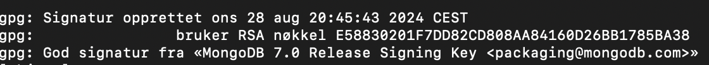
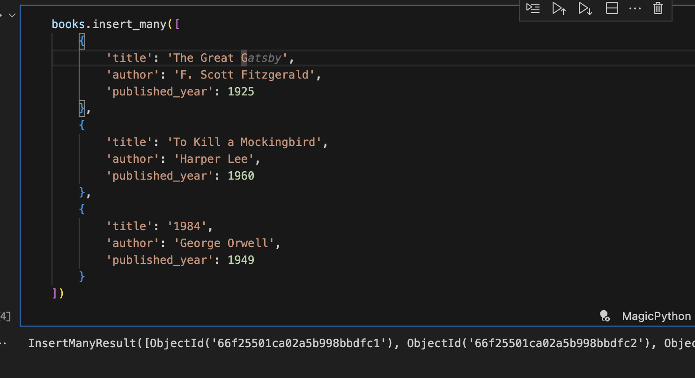
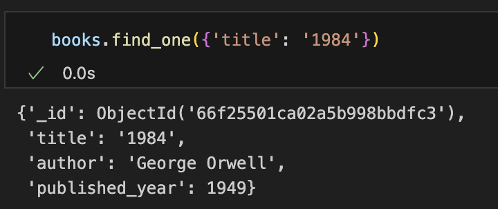
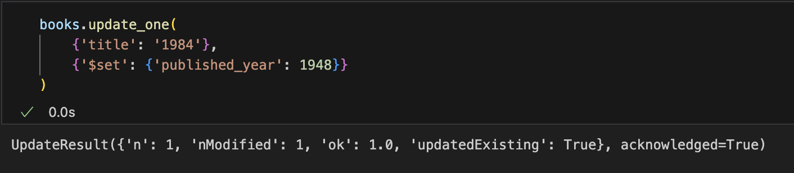
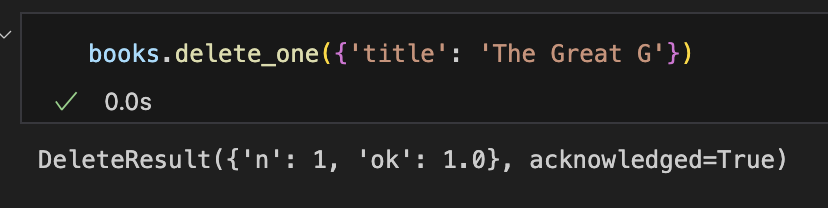
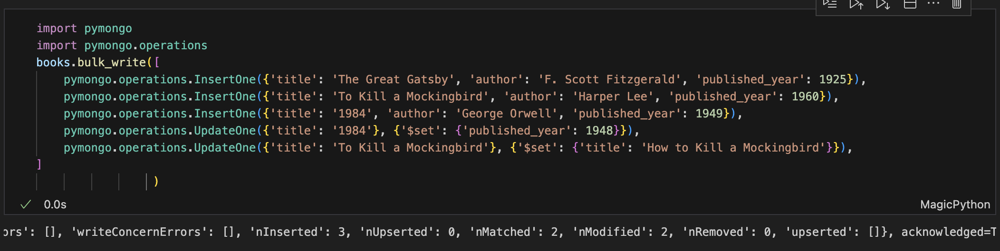
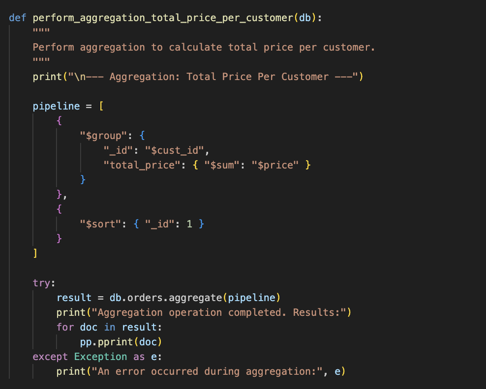
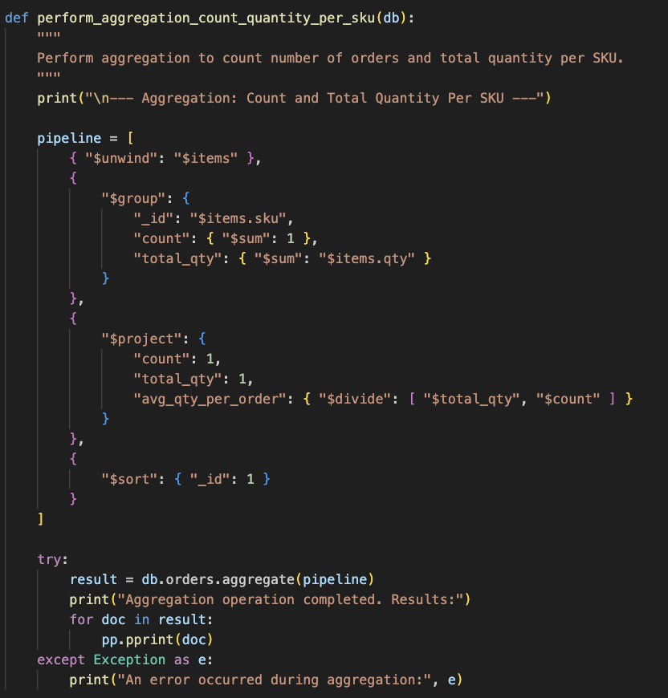
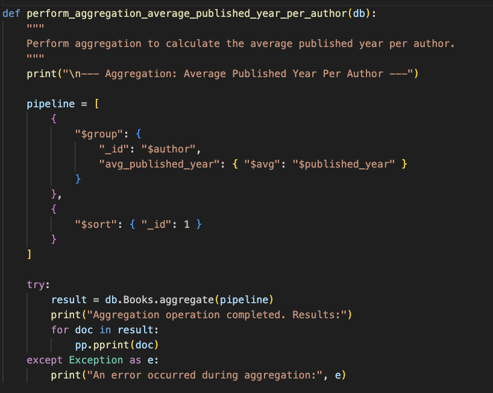

# DAT250 - Experiment Assignment 5: 

## Technical Problems and Resolutions

### MongoDB Version Issue
- **Problem:** I initially planned to use MongoDB 4.4, but due to compatibility issues, I had to install version 7.0, which lacks full Map-Reduce support.
- **Solution:** I switched to using the Aggregation Framework, which is more prominent in MongoDB 7.0.

### Path Configuration Issue
- **Problem:** MongoDB binaries were not recognized in the terminal.
- **Solution:** Added the MongoDB binary path to the system PATH configuration.

### Screenshot: MongoDB Installation Verification

## Experiment 1: CRUD Operations

### Create, Read, Update, Delete Results
- **Create:** Inserted sample documents into the `Books` collection.

- **Read:** 

- **Update:**

- **Delete:** 

- **Bulk:** Bulk opreations: 

## Experiment 2: Aggregation Operations

Due to MongoDB 7.0’s limited Map-Reduce support, I used the Aggregation Framework to perform the following:

### Total Price Per Customer
- **Result:** Aggregated total spending per customer.

### Count and Quantity Per SKU
- **Result:** Counted orders and total quantities for each SKU, calculated average quantity per order.

### Average Published Year Per Author (Additional Aggregation)
- **Result:** Calculated average publication year per author.

## Reasoning and Interpretation

### Aggregation Usefulness
- **Efficiency:** Aggregation pipelines are faster and simpler than Map-Reduce.
- **Insights:** Provided clear insights into customer behavior, product demand, and author publication trends.

### Interpretation:
- **Total Price Per Customer:** Shows top spenders.
- **SKU Analysis:** Popular products like "oranges" and "apples."
- **Average Published Year:** Reflects author activity periods.

## Pending Issues
- **Map-Reduce Support:** MongoDB 7.0’s lack of Map-Reduce forced the use of Aggregation.
- **Next Steps:** Continue exploring advanced Aggregation operations like `$lookup`.

## Conclusion
This experiment demonstrated the successful use of MongoDB’s Aggregation Framework, providing insights into customer and product data. Switching from Map-Reduce to Aggregation improved performance and clarity.
